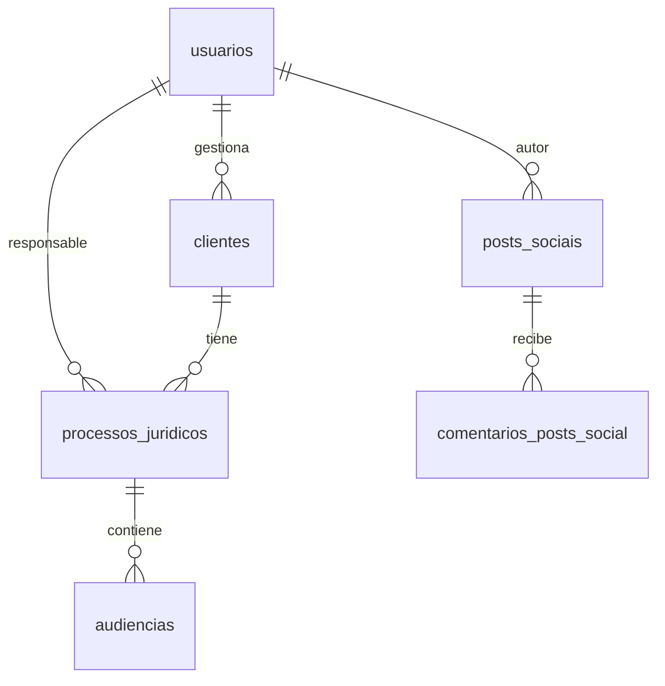

# Database Schema - Advocacia Wilson

📅 **Última actualización:** 16/02/2026  
🗄️ **Base de datos:** Supabase (PostgreSQL 15+)  
🔒 **Seguridad:** Row Level Security (RLS) habilitado

---

## 📋 Tabla de Contenidos

- [Estructura del Schema](#estructura-del-schema)
- [Archivos Principales](#archivos-principales)
- [Migraciones](#migraciones)
- [Tablas Activas](#tablas-activas)
- [Tablas Removidas](#tablas-removidas)
- [Instalación Nueva](#instalación-nueva)
- [Actualización de DB Existente](#actualización-de-db-existente)

---

## 🏗️ Estructura del Schema

### Tablas Activas (En Uso)

| Tabla | Propósito | Relaciones | Estado |
|-------|----------|------------|--------|
| `usuarios` | Equipo legal (admin, advogado, assistente) | - | ✅ Activa |
| `clientes` | Clientes del despacho | → usuarios | ✅ Activa |
| `processos_juridicos` | Procesos legales | → usuarios, clientes | ✅ Activa |
| `audiencias` | Audiencias de procesos | → processos_juridicos, usuarios | ✅ Activa |
| `posts_sociais` | Contenido del sitio web | → usuarios | ✅ Activa |
| `comentarios_posts_social` | Comentarios en posts | → posts_sociais | ✅ Activa |
| `audit_log` | Registro de auditoría | → usuarios | ✅ Activa |

### Vistas Activas

| Vista | Propósito | Tabla Base | Estado |
|-------|----------|------------|--------|
| `view_processos_completos` | Procesos con JOINs | processos_juridicos | ✅ Activa |
| `view_comentarios_count` | Conteo de comentarios | comentarios_posts_social | ✅ Activa (no usada) |

---

## 📁 Archivos Principales

### Schema y Setup

```
database/
├── schema.sql                    # ⭐ Schema principal ACTUALIZADO (sin tablas obsoletas)
├── rls-policies.sql              # Políticas de seguridad actualizadas
├── storage-buckets-setup.sql     # Configuración de Storage (avatares, documentos)
└── README.md                     # Este archivo
```

### Migraciones Recientes (2026)

```
database/
├── migration-eliminar-documentos-jurisprudencias.sql  # ⚠️  NUEVA: Elimina tablas obsoletas
├── migration-posts-ownership-permissions.sql          # Permisos por ownership en posts
├── migration-numero-processo-nullable.sql             # numero_processo opcional
├── migration-datos-audiencias.sql                     # Migrar audiencias de JSONB a tabla
└── migration-normalizacao-clientes.sql                # Normalización de clientes
```

### Migraciones Legacy (2025)

```
database/
├── migration-2025-01-29-complete.sql  # ⚠️  Crea tablas obsoletas (ver advertencias)
└── [otras migraciones 2025...]
```

### Documentación

```
database/
├── MIGRATION_GUIDE.md            # Guía de migraciones (audiencias + tablas obsoletas)
docs/
└── ANALISIS_TABLAS_OBSOLETAS.md  # Análisis de eliminación de tablas
```

---

## 🔄 Migraciones

### Orden de Ejecución (Base de Datos Nueva)

Para una instalación limpia desde cero:

1. **Schema Principal**
   ```bash
   # Ejecutar en Supabase SQL Editor
   database/schema.sql
   ```

2. **RLS Policies**
   ```bash
   database/rls-policies.sql
   ```

3. **Storage Buckets**
   ```bash
   database/storage-buckets-setup.sql
   ```

4. **Tablas Específicas** (si necesario)
   ```bash
   database/clientes-schema.sql
   database/audiencias-schema.sql
   database/comentarios-social-schema.sql
   ```

5. **Datos Iniciales** (opcional)
   ```sql
   -- Crear usuarios de prueba, etc.
   ```

### Actualización de Base de Datos Existente

Si ya tienes una base de datos con las **tablas obsoletas**:

1. **Eliminar Tablas Obsoletas** (RECOMENDADO)
   ```bash
   database/migration-eliminar-documentos-jurisprudencias.sql
   ```

2. **Actualizar Permisos de Posts**
   ```bash
   database/migration-posts-ownership-permissions.sql
   database/fix-posts-remove-extra-policies.sql  # Limpiar duplicados
   ```

3. **Hacer numero_processo Opcional**
   ```bash
   database/migration-numero-processo-nullable.sql
   ```

4. **Migrar Audiencias** (si usabas JSONB)
   ```bash
   database/migration-datos-audiencias.sql
   ```

---

## 🗃️ Tablas Activas

### 1. usuarios
Equipo legal del despacho.

**Campos principales:**
- `id` UUID (PK)
- `email` VARCHAR(255) UNIQUE
- `nome` VARCHAR(255)
- `nome_completo` TEXT
- `role` VARCHAR(20) - 'admin' | 'advogado' | 'assistente'
- `foto_perfil_url` TEXT
- Campo JSONB: `redes_sociais`

**RLS:** Habilitado con políticas por role  
**Auditoría:** `creado_por`, `atualizado_por` (automáticos)

### 2. clientes
Clientes del despacho.

**Campos principales:**
- `id` UUID (PK)
- `nome_completo` TEXT (UNIQUE, obligatorio) - No editable por advogado/assistente
- `cpf_cnpj` VARCHAR(20)
- `email` VARCHAR(255)
- Campo JSONB: `documentos_cliente` (DocumentoArquivo[])

**RLS:** Todos pueden leer, crear, editar (con restricciones)  
**Storage:** Bucket `documentos-cliente` (privado)

### 3. processos_juridicos
Procesos legales.

**Campos principales:**
- `id` UUID (PK)
- `titulo` VARCHAR(500)
- `descricao` TEXT
- `status` VARCHAR(20) - 'em_aberto' | 'em_andamento' | 'fechado'
- `advogado_responsavel` UUID (FK → usuarios) - No editable por advogado/assistente
- `cliente_id` UUID (FK → clientes)
- `polo` VARCHAR(20) - 'ativo' | 'passivo'
- `numero_processo` VARCHAR(100) UNIQUE (opcional, nullable desde 16/02/2026)
- Campos JSONB: `jurisdicao`, `honorarios`, `documentos_processo`, `links_processo`, `jurisprudencia`

**RLS:** Habilitado con políticas por role  
**Storage:** Bucket `documentos-processo` (privado)  
**Auditoría:** `creado_por`, `atualizado_por` (automáticos)

### 4. audiencias
Audiencias de procesos (tabla relacional desde migración JSONB).

**Campos principales:**
- `id` UUID (PK)
- `processo_id` UUID (FK → processos_juridicos)
- `data` DATE
- `horario` TIME
- `tipo` VARCHAR(50) - 'Conciliação' | 'Instrução'
- `forma` VARCHAR(50) - 'Presencial' | 'Virtual' | 'Híbrida'
- `local` TEXT
- `advogado_responsavel` UUID (FK → usuarios)

**RLS:** Habilitado  
**Relación:** 1:N con processos_juridicos

### 5. posts_sociais
Contenido del sitio web (artículos, videos, noticias).

**Campos principales:**
- `id` UUID (PK)
- `titulo` VARCHAR(500)
- `conteudo` TEXT
- `tipo` VARCHAR(20) - 'article' | 'video' | 'image' | 'announcement'
- `autor` UUID (FK → usuarios)
- `publicado` BOOLEAN
- `destaque` BOOLEAN
- `tags` TEXT[]

**RLS:** Habilitado con permisos por ownership (16/02/2026)
- Admin: CRUD completo
- Advogado: CREATE + READ all + UPDATE/DELETE propios

### 6. comentarios_posts_social
Comentarios en posts.

**Campos principales:**
- `id` UUID (PK)
- `post_id` UUID (FK → posts_sociais)
- `autor_nome` VARCHAR(255)
- `comentario` TEXT
- `aprovado` BOOLEAN (moderación)

**RLS:** Lectura pública (si aprobado), creación pública, gestión admin

### 7. audit_log
Registro de auditoría del sistema.

**Campos principales:**
- `id` UUID (PK)
- `table_name` VARCHAR(100)
- `record_id` UUID
- `operation` VARCHAR(20) - 'INSERT' | 'UPDATE' | 'DELETE'
- `usuario_id` UUID (FK → usuarios)
- `old_data` JSONB
- `new_data` JSONB
- `changed_fields` TEXT[]

**RLS:** Solo admin puede leer

---

## 🗑️ Tablas Removidas

### ❌ documentos (Eliminada 16/02/2026)

**Motivo:** NUNCA utilizada en el frontend.

**Implementación actual:** Campos JSONB
- `clientes.documentos_cliente`
- `processos_juridicos.documentos_processo`

**Interface TypeScript:**
```typescript
interface DocumentoArquivo {
  nome: string
  url: string
  tipo: string
  tamanho?: number
  data_upload?: string
}
```

**Referencias:**
- Script de eliminación: `migration-eliminar-documentos-jurisprudencias.sql`
- Análisis completo: `docs/ANALISIS_TABLAS_OBSOLETAS.md`

### ❌ jurisprudencias (Eliminada 16/02/2026)

**Motivo:** NUNCA utilizada en el frontend.

**Implementación actual:** Campo JSONB
- `processos_juridicos.jurisprudencia`

**Interface TypeScript:**
```typescript
interface Jurisprudencia {
  ementa: string
  link: string
}
```

**Gestión:** CRUD completo en `ProcessosPage.tsx` con `jurisprudenciasCrud` hook

---

## 🚀 Instalación Nueva

### Paso 1: Crear Proyecto en Supabase

1. Ir a [supabase.com](https://supabase.com)
2. Crear nuevo proyecto
3. Guardar credenciales (URL, anon key, service_role key)

### Paso 2: Ejecutar Schema

```sql
-- En Supabase SQL Editor
-- Copiar y ejecutar archivo completo:
database/schema.sql
```

**Resultado esperado:**
- 7 tablas creadas
- 2 vistas creadas
- ~30 índices creados
- ~15 RLS policies creadas
- ~10 triggers creados

### Paso 3: Configurar RLS Policies

```sql
-- En Supabase SQL Editor
database/rls-policies.sql
```

### Paso 4: Configurar Storage

```sql
-- En Supabase SQL Editor
database/storage-buckets-setup.sql
```

**Buckets creados:**
- `avatars` (público)
- `documentos-cliente` (privado)
- `documentos-processo` (privado)
- `posts-images` (público)

### Paso 5: Verificar Instalación

```sql
-- Verificar tablas
SELECT table_name 
FROM information_schema.tables 
WHERE table_schema = 'public' 
ORDER BY table_name;

-- Debe retornar 7 tablas (NO debe incluir 'documentos' ni 'jurisprudencias')

-- Verificar RLS
SELECT tablename, rowsecurity 
FROM pg_tables 
WHERE schemaname = 'public';

-- Todas deben tener rowsecurity = true

-- Verificar Storage
SELECT name, public 
FROM storage.buckets;

-- Debe retornar 4 buckets
```

---

## 🔄 Actualización de DB Existente

### Si tu DB tiene tablas obsoletas

**Verificar:**
```sql
SELECT table_name 
FROM information_schema.tables 
WHERE table_schema = 'public' 
AND table_name IN ('documentos', 'jurisprudencias');
```

**Si retorna resultados, ejecutar:**
```sql
-- Eliminar tablas obsoletas
database/migration-eliminar-documentos-jurisprudencias.sql
```

**Verificar eliminación:**
```sql
-- Debe retornar 0 filas
SELECT COUNT(*) 
FROM information_schema.tables 
WHERE table_schema = 'public' 
AND table_name IN ('documentos', 'jurisprudencias');
```

### Actualizar Permisos de Posts

```sql
-- 1. Crear políticas con ownership
database/migration-posts-ownership-permissions.sql

-- 2. Eliminar políticas duplicadas
database/fix-posts-remove-extra-policies.sql
```

**Verificar:**
```sql
SELECT policyname 
FROM pg_policies 
WHERE tablename = 'posts_sociais';

-- Debe retornar exactamente 4 policies:
-- - posts_select_policy
-- - posts_insert_policy
-- - posts_update_policy
-- - posts_delete_policy
```

---

## 📚 Recursos Adicionales

### Documentación

- [MIGRATION_GUIDE.md](MIGRATION_GUIDE.md) - Guía completa de migraciones
- [docs/ANALISIS_TABLAS_OBSOLETAS.md](../docs/ANALISIS_TABLAS_OBSOLETAS.md) - Análisis de eliminación
- [docs/RLS.md](../docs/RLS.md) - Documentación de políticas RLS

### Diagramas



### TypeScript Types

Ver interfaces completas en:
- `src/types/usuario.ts`
- `src/types/cliente.ts`
- `src/types/processo.ts`
- `src/types/audiencia.ts`
- `src/types/post.ts`
- `src/types/documento.ts`

---

## ⚙️ Configuración

### Variables de Entorno (.env)

```env
VITE_SUPABASE_URL=https://tu-proyecto.supabase.co
VITE_SUPABASE_ANON_KEY=tu-anon-key
```

### Conexión (Frontend)

```typescript
// src/lib/supabase.ts
import { createClient } from '@supabase/supabase-js'

export const supabase = createClient(
  import.meta.env.VITE_SUPABASE_URL,
  import.meta.env.VITE_SUPABASE_ANON_KEY
)
```

---

## 🔒 Seguridad

### Row Level Security (RLS)

**Todas las tablas** tienen RLS habilitado.

**Políticas por tabla:**
- `usuarios`: SELECT propio + INSERT/UPDATE/DELETE por role
- `clientes`: SELECT/INSERT/UPDATE todos autenticados (con restricciones)
- `processos_juridicos`: SELECT/INSERT/UPDATE todos autenticados (con restricciones), DELETE solo admin
- `audiencias`: Basado en role
- `posts_sociais`: SELECT públicos, INSERT advogado/admin, UPDATE/DELETE ownership
- `comentarios_posts_social`: SELECT aprobados, INSERT público, UPDATE/DELETE admin
- `audit_log`: SELECT solo admin, INSERT sistema

### Storage Policies

**Buckets privados:**
- `documentos-cliente`: Solo usuarios autenticados
- `documentos-processo`: Solo usuarios autenticados

**Buckets públicos:**
- `avatars`: Lectura pública, escritura autenticada
- `posts-images`: Lectura pública, escritura autenticada

---

## 🐛 Troubleshooting

### Error: Política RLS bloqueando INSERT

**Causa:** Usuario no autenticado o sin permisos

**Solución:**
```sql
-- Verificar usuario actual
SELECT auth.uid();

-- Verificar políticas
SELECT * FROM pg_policies WHERE tablename = 'nombre_tabla';
```

### Error: Campos de auditoría no se llenan

**Causa:** Triggers de auditoría no ejecutados

**Solución:**
```sql
-- Verificar triggers
SELECT tgname, tgrelid::regclass, tgenabled 
FROM pg_trigger 
WHERE tgname LIKE '%audit%';

-- Re-crear triggers si es necesario
DROP TRIGGER IF EXISTS tabla_audit_insert ON tabla;
CREATE TRIGGER tabla_audit_insert
    BEFORE INSERT ON tabla
    FOR EACH ROW
    EXECUTE FUNCTION audit_creado_por();
```

### Error: Tabla 'documentos' no existe

**Causa:** Intentando usar tabla obsoleta

**Solución:** Usar campos JSONB en su lugar
```typescript
// ❌ NO HACER
const { data } = await supabase.from('documentos').select('*')

// ✅ HACER
const { data } = await supabase
  .from('clientes')
  .select('documentos_cliente')
  .eq('id', clienteId)
```

---

## 📞 Soporte

Para dudas o problemas:
1. Revisar documentación en `docs/`
2. Verificar migraciones en `database/`
3. Consultar logs de Supabase Dashboard

---

**Última revisión:** 16/02/2026  
**Versión del Schema:** 2.0 (sin tablas obsoletas)  
**PostgreSQL:** 15+  
**Supabase:** Compatible
