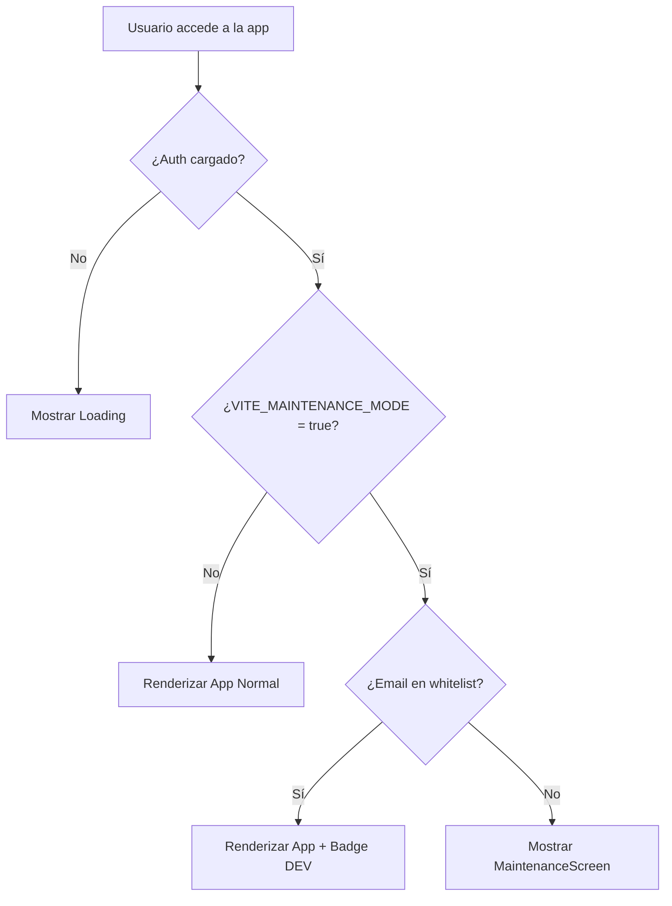

# 🔧 PLAN: Sistema de Modo Mantenimiento

> **Sistema modular y reutilizable para bloquear acceso durante mantenimiento**  
> Fecha: 03/03/2026  
> Estado: 📋 Planeado

---

## 📋 Tabla de Contenido

1. [Visión General](#visión-general)
2. [Requisitos](#requisitos)
3. [Arquitectura Propuesta](#arquitectura-propuesta)
4. [Estructura de Archivos](#estructura-de-archivos)
5. [Componentes y Funcionalidades](#componentes-y-funcionalidades)
6. [Flujo de Funcionamiento](#flujo-de-funcionamiento)
7. [Configuración](#configuración)
8. [Implementación Paso a Paso](#implementación-paso-a-paso)
9. [Testing](#testing)
10. [Reutilización en Otros Proyectos](#reutilización-en-otros-proyectos)

---

## 🎯 Visión General

### Objetivo
Crear un sistema que permita **bloquear temporalmente** el acceso a la aplicación durante mantenimiento de base de datos, mostrando mensaje personalizado a usuarios regulares mientras **DEVs mantienen acceso completo**.

### Características Principales
- ✅ Activación/desactivación mediante variable de entorno
- ✅ Whitelist de emails de desarrolladores
- ✅ Pantalla de mantenimiento elegante y responsive
- ✅ Acceso transparente para DEVs (sin notificación)
- ✅ 100% modular y reutilizable
- ✅ Sin dependencias externas específicas
- ✅ TypeScript strict mode compatible
- ✅ Fácil configuración en .env

---

## 📋 Requisitos

### Funcionales
1. **Bloqueo Global**: Interceptar todas las rutas protegidas
2. **Whitelist de DEVs**: Lista configurable de emails con acceso
3. **Mensaje Personalizable**: Texto y diseño customizable
4. **Control por ENV**: Activar/desactivar sin deploy
5. **Verificación de Usuario**: Check contra base de datos de usuarios autenticados

### No Funcionales
1. **Performance**: No impactar carga de la app (< 50ms)
2. **Seguridad**: No exponer lista de DEVs en cliente
3. **Modularidad**: Carpeta aislada, fácil de copiar/pegar
4. **Compatibilidad**: React 18+, TypeScript 5+
5. **Mantenibilidad**: Documentación clara, código autoexplicativo

---

## 🏗️ Arquitectura Propuesta

### Patrón: Guard Pattern + Feature Module

```
┌─────────────────────────────────────────────────────────┐
│                      App.tsx                             │
│  ┌────────────────────────────────────────────────────┐ │
│  │           <MaintenanceGuard>                       │ │
│  │  ┌──────────────────────────────────────────────┐ │ │
│  │  │  useMaintenanceMode()                        │ │ │
│  │  │    ↓                                         │ │ │
│  │  │  ¿Maintenance ON?                            │ │ │
│  │  │    ├─ NO → Renderizar App normal             │ │ │
│  │  │    └─ SI → ¿Es DEV?                          │ │ │
│  │  │              ├─ SI → Renderizar App normal   │ │ │
│  │  │              └─ NO → MaintenanceScreen       │ │ │
│  │  └──────────────────────────────────────────────┘ │ │
│  └────────────────────────────────────────────────────┘ │
└─────────────────────────────────────────────────────────┘
```

### Decisiones de Diseño

**1. Variable de Entorno vs Backend Flag**
- ✅ **Elegido**: Variable de entorno (.env)
- **Razón**: Más rápido, no requiere deploy, no depende de DB
- **Trade-off**: Requiere restart del servidor (Vite HMR lo detecta)

**2. Whitelist en Frontend vs Backend**
- ✅ **Elegido**: Híbrido
  - Lista en `.env` (fácil de actualizar)
  - Verificación de email del usuario autenticado
- **Razón**: Balance entre seguridad y facilidad de uso

**3. Guard en App vs Router**
- ✅ **Elegido**: Guard en App.tsx (nivel alto)
- **Razón**: Intercepta TODA la aplicación, incluye rutas públicas si necesario

---

## 📁 Estructura de Archivos

### Árbol Completo del Feature

```
src/
├── features/
│   └── maintenance/                    # 🆕 Feature Module
│       ├── index.ts                    # Public API exports
│       ├── components/
│       │   ├── MaintenanceScreen.tsx   # Pantalla de bloqueo
│       │   ├── MaintenanceGuard.tsx    # Guard principal
│       │   └── MaintenanceBadge.tsx    # Badge para DEVs (opcional)
│       ├── hooks/
│       │   └── useMaintenanceMode.ts   # Lógica de verificación
│       ├── config/
│       │   └── maintenance.config.ts   # Constantes y configuración
│       ├── types/
│       │   └── maintenance.types.ts    # TypeScript interfaces
│       └── utils/
│           ├── checkMaintenanceAccess.ts  # Helpers de verificación
│           └── parseDevEmails.ts          # Parser de whitelist
│
├── App.tsx                             # ✏️ Modificar: Wrap con MaintenanceGuard
└── .env                                # ✏️ Agregar variables
```

### Tamaño Estimado
- **Archivos**: 9 archivos nuevos
- **Líneas de código**: ~400 líneas total
- **Tiempo de implementación**: 2-3 horas
- **Complejidad**: 🟢 Baja-Media

---

## 🧩 Componentes y Funcionalidades

### 1. `MaintenanceGuard.tsx` (Guard Principal)

**Responsabilidad**: Interceptar y decidir si renderizar app o pantalla de mantenimiento

```typescript
interface MaintenanceGuardProps {
  children: React.ReactNode;
}

export function MaintenanceGuard({ children }: MaintenanceGuardProps) {
  const { isMaintenanceMode, isDevAccess, isLoading } = useMaintenanceMode();
  
  // Loading state
  if (isLoading) {
    return <LoadingScreen />;
  }
  
  // Maintenance mode active AND user is NOT a dev
  if (isMaintenanceMode && !isDevAccess) {
    return <MaintenanceScreen />;
  }
  
  // Normal flow
  return <>{children}</>;
}
```

**Props**: 
- `children`: Contenido de la app

**Estados**:
- `isLoading`: Verificando estado de usuario
- `isMaintenanceMode`: Modo mantenimiento activo
- `isDevAccess`: Usuario tiene acceso de dev

---

### 2. `MaintenanceScreen.tsx` (Pantalla de Bloqueo)

**Responsabilidad**: UI elegante de bloqueo para usuarios regulares

```typescript
export function MaintenanceScreen() {
  return (
    <div className="min-h-screen bg-gradient-to-br from-primary-50 to-primary-100">
      <div className="flex items-center justify-center min-h-screen p-4">
        <div className="max-w-md w-full bg-white rounded-2xl shadow-2xl p-8 text-center">
          {/* Icon */}
          <div className="mb-6">
            <Settings className="w-20 h-20 mx-auto text-primary-500 animate-spin-slow" />
          </div>
          
          {/* Title */}
          <h1 className="text-3xl font-bold text-neutral-800 mb-4">
            Sistema en Mantenimiento
          </h1>
          
          {/* Message */}
          <p className="text-neutral-600 mb-6 leading-relaxed">
            Estamos trabajando para mejorar tu experiencia.
            Volveremos pronto con nuevas funcionalidades.
          </p>
          
          {/* Estimated time */}
          <div className="bg-primary-50 rounded-lg p-4 mb-6">
            <p className="text-sm text-primary-700">
              ⏱️ Tiempo estimado: <strong>15-30 minutos</strong>
            </p>
          </div>
          
          {/* Contact info */}
          <p className="text-sm text-neutral-500">
            ¿Urgente? Contacta a soporte: 
            <a href="mailto:soporte@example.com" className="text-primary-600 hover:underline ml-1">
              soporte@example.com
            </a>
          </p>
        </div>
      </div>
    </div>
  );
}
```

**Características**:
- ✅ Responsive (mobile-first)
- ✅ Animación suave del icono
- ✅ Mensaje personalizable vía props
- ✅ Información de contacto
- ✅ Tiempo estimado de mantenimiento

**Props opcionales**:
```typescript
interface MaintenanceScreenProps {
  title?: string;
  message?: string;
  estimatedTime?: string;
  contactEmail?: string;
  logoUrl?: string;
}
```

---

### 3. `useMaintenanceMode.ts` (Hook Principal)

**Responsabilidad**: Lógica de verificación de modo mantenimiento y acceso dev

```typescript
interface UseMaintenanceModeReturn {
  isMaintenanceMode: boolean;
  isDevAccess: boolean;
  isLoading: boolean;
  devEmails: string[];
}

export function useMaintenanceMode(): UseMaintenanceModeReturn {
  const { user } = useAuth(); // Hook de autenticación existente
  const [isLoading, setIsLoading] = useState(true);
  
  // 1. Check environment variable
  const isMaintenanceMode = import.meta.env.VITE_MAINTENANCE_MODE === 'true';
  
  // 2. Get dev emails whitelist
  const devEmails = useMemo(() => parseDevEmails(), []);
  
  // 3. Check if current user is dev
  const isDevAccess = useMemo(() => {
    if (!user || !user.email) return false;
    return devEmails.includes(user.email.toLowerCase());
  }, [user, devEmails]);
  
  // 4. Handle loading state
  useEffect(() => {
    // Simulate auth check (if needed)
    const timer = setTimeout(() => setIsLoading(false), 100);
    return () => clearTimeout(timer);
  }, [user]);
  
  return {
    isMaintenanceMode,
    isDevAccess,
    isLoading,
    devEmails, // Para debugging (NO exponer en producción)
  };
}
```

**Dependencias**:
- `useAuth()`: Hook existente para obtener usuario autenticado
- `parseDevEmails()`: Utility para parsear lista de emails

**Performance**:
- `useMemo` para evitar re-cálculos innecesarios
- Check de ENV es instantáneo (compile-time)

---

### 4. `maintenance.config.ts` (Configuración)

**Responsabilidad**: Constantes y mensajes centralizados

```typescript
export const MAINTENANCE_CONFIG = {
  // Environment variable keys
  ENV_KEYS: {
    MAINTENANCE_MODE: 'VITE_MAINTENANCE_MODE',
    DEV_EMAILS: 'VITE_MAINTENANCE_DEV_EMAILS',
  },
  
  // Default messages (can be overridden)
  MESSAGES: {
    TITLE: 'Sistema en Mantenimiento',
    MESSAGE: 'Estamos trabajando para mejorar tu experiencia. Volveremos pronto.',
    ESTIMATED_TIME: '15-30 minutos',
    CONTACT_EMAIL: 'soporte@wilsonalbuquerque.adv.br',
  },
  
  // UI configuration
  UI: {
    ICON_SIZE: 80,
    ANIMATION_DURATION: '3s',
    SHOW_CONTACT: true,
    SHOW_ESTIMATED_TIME: true,
  },
  
  // Dev badge (optional feature)
  DEV_BADGE: {
    ENABLED: true,
    TEXT: '🛠️ Modo Desarrollador',
    POSITION: 'top-right' as const,
  },
} as const;

export type MaintenanceConfig = typeof MAINTENANCE_CONFIG;
```

---

### 5. `checkMaintenanceAccess.ts` (Utilities)

**Responsabilidad**: Funciones auxiliares de verificación

```typescript
/**
 * Check if maintenance mode is active
 */
export function isMaintenanceModeActive(): boolean {
  return import.meta.env.VITE_MAINTENANCE_MODE === 'true';
}

/**
 * Parse dev emails from environment variable
 * Format: "email1@example.com,email2@example.com,email3@example.com"
 */
export function parseDevEmails(): string[] {
  const envValue = import.meta.env.VITE_MAINTENANCE_DEV_EMAILS;
  
  if (!envValue || typeof envValue !== 'string') {
    return [];
  }
  
  return envValue
    .split(',')
    .map(email => email.trim().toLowerCase())
    .filter(email => email.length > 0 && isValidEmail(email));
}

/**
 * Basic email validation
 */
function isValidEmail(email: string): boolean {
  const emailRegex = /^[^\s@]+@[^\s@]+\.[^\s@]+$/;
  return emailRegex.test(email);
}

/**
 * Check if user has dev access
 */
export function hasDevAccess(userEmail: string | null | undefined): boolean {
  if (!userEmail) return false;
  
  const devEmails = parseDevEmails();
  return devEmails.includes(userEmail.toLowerCase());
}

/**
 * Get maintenance status info (for debugging)
 */
export function getMaintenanceStatus() {
  return {
    isActive: isMaintenanceModeActive(),
    devEmails: parseDevEmails().length, // Count only, not emails
    timestamp: new Date().toISOString(),
  };
}
```

---

### 6. `MaintenanceBadge.tsx` (Opcional)

**Responsabilidad**: Badge visual para DEVs indicando que están en modo mantenimiento

```typescript
export function MaintenanceBadge() {
  const { isMaintenanceMode, isDevAccess } = useMaintenanceMode();
  
  // Only show for devs when maintenance is active
  if (!isMaintenanceMode || !isDevAccess) {
    return null;
  }
  
  return (
    <div className="fixed top-4 right-4 z-50">
      <div className="bg-yellow-500 text-yellow-900 px-4 py-2 rounded-lg shadow-lg flex items-center gap-2 animate-pulse">
        <Settings className="w-5 h-5" />
        <span className="font-semibold text-sm">
          Modo Mantenimiento (DEV)
        </span>
      </div>
    </div>
  );
}
```

**Uso**: Agregar en App.tsx para feedback visual a devs

---

## 🔄 Flujo de Funcionamiento

### Diagrama de Flujo



### Casos de Uso

#### Caso 1: Usuario Regular - Mantenimiento OFF
```
1. Usuario accede → App.tsx
2. MaintenanceGuard verifica ENV
3. VITE_MAINTENANCE_MODE = false
4. ✅ Renderiza app normal
```

#### Caso 2: Usuario Regular - Mantenimiento ON
```
1. Usuario accede → App.tsx
2. MaintenanceGuard verifica ENV
3. VITE_MAINTENANCE_MODE = true
4. Verifica email del usuario
5. Email NO está en whitelist
6. 🚫 Renderiza MaintenanceScreen
```

#### Caso 3: DEV - Mantenimiento ON
```
1. DEV accede → App.tsx
2. MaintenanceGuard verifica ENV
3. VITE_MAINTENANCE_MODE = true
4. Verifica email del DEV
5. Email SÍ está en whitelist
6. ✅ Renderiza app normal + MaintenanceBadge
```

#### Caso 4: Usuario No Autenticado - Mantenimiento ON
```
1. Usuario no logado accede → App.tsx
2. MaintenanceGuard verifica ENV
3. VITE_MAINTENANCE_MODE = true
4. No hay usuario autenticado
5. 🚫 Renderiza MaintenanceScreen
```

---

## ⚙️ Configuración

### Variables de Entorno (.env)

```bash
# .env.local (Development)
VITE_MAINTENANCE_MODE=false
VITE_MAINTENANCE_DEV_EMAILS=dev1@example.com,dev2@example.com,admin@example.com

# .env.production (Production - durante mantenimiento)
VITE_MAINTENANCE_MODE=true
VITE_MAINTENANCE_DEV_EMAILS=wilton@email.com,dev@wilsonalbuquerque.adv.br
```

### Tipos de ENV (.env.d.ts)

```typescript
/// <reference types="vite/client" />

interface ImportMetaEnv {
  readonly VITE_MAINTENANCE_MODE: string;
  readonly VITE_MAINTENANCE_DEV_EMAILS: string;
  // ... otras variables existentes
}

interface ImportMeta {
  readonly env: ImportMetaEnv;
}
```

### Ejemplo de Activación

**Escenario**: Necesitas hacer cambios en la base de datos

1. **Antes del mantenimiento**:
   ```bash
   # .env.production
   VITE_MAINTENANCE_MODE=false
   ```

2. **Activar mantenimiento**:
   ```bash
   # .env.production
   VITE_MAINTENANCE_MODE=true
   VITE_MAINTENANCE_DEV_EMAILS=wilton@email.com,admin@example.com
   ```
   
3. **Rebuild y Deploy**:
   ```bash
   npm run build
   # Deploy to production
   ```

4. **DEVs trabajan normalmente** (whitelist activa)

5. **Desactivar mantenimiento**:
   ```bash
   # .env.production
   VITE_MAINTENANCE_MODE=false
   ```
   
6. **Rebuild y Deploy**:
   ```bash
   npm run build
   # Deploy to production
   ```

---

## 🛠️ Implementación Paso a Paso

### Fase 1: Setup Inicial (15 minutos)

#### Paso 1.1: Crear estructura de carpetas
```bash
mkdir -p src/features/maintenance/{components,hooks,config,types,utils}
```

#### Paso 1.2: Agregar variables a .env
```bash
# Agregar al .env.local
echo "VITE_MAINTENANCE_MODE=false" >> .env.local
echo "VITE_MAINTENANCE_DEV_EMAILS=your-email@example.com" >> .env.local
```

#### Paso 1.3: Actualizar tipos de ENV
```bash
# Editar src/vite-env.d.ts
```

---

### Fase 2: Implementar Utilities y Config (20 minutos)

#### Paso 2.1: Crear maintenance.types.ts
```typescript
// src/features/maintenance/types/maintenance.types.ts
export interface MaintenanceMode {
  isActive: boolean;
  devEmails: string[];
}

export interface MaintenanceScreenProps {
  title?: string;
  message?: string;
  estimatedTime?: string;
  contactEmail?: string;
  logoUrl?: string;
}

export interface MaintenanceGuardProps {
  children: React.ReactNode;
  loadingComponent?: React.ReactNode;
}
```

#### Paso 2.2: Crear maintenance.config.ts
```typescript
// (Ver código completo arriba)
```

#### Paso 2.3: Crear checkMaintenanceAccess.ts
```typescript
// (Ver código completo arriba)
```

---

### Fase 3: Implementar Hooks (25 minutos)

#### Paso 3.1: Crear useMaintenanceMode.ts
```typescript
// (Ver código completo arriba)
```

#### Paso 3.2: Testing del hook
```typescript
// src/features/maintenance/hooks/__tests__/useMaintenanceMode.test.ts
import { renderHook } from '@testing-library/react';
import { useMaintenanceMode } from '../useMaintenanceMode';

describe('useMaintenanceMode', () => {
  it('should detect maintenance mode from env', () => {
    const { result } = renderHook(() => useMaintenanceMode());
    expect(result.current.isMaintenanceMode).toBeDefined();
  });
});
```

---

### Fase 4: Implementar Componentes (40 minutos)

#### Paso 4.1: Crear MaintenanceScreen.tsx
```typescript
// (Ver código completo arriba)
```

#### Paso 4.2: Crear MaintenanceGuard.tsx
```typescript
// (Ver código completo arriba)
```

#### Paso 4.3: Crear MaintenanceBadge.tsx (opcional)
```typescript
// (Ver código completo arriba)
```

---

### Fase 5: Integración en App (15 minutos)

#### Paso 5.1: Modificar App.tsx

**Antes**:
```typescript
function App() {
  return (
    <Router>
      <Routes>
        {/* ... rutas */}
      </Routes>
    </Router>
  );
}
```

**Después**:
```typescript
import { MaintenanceGuard } from './features/maintenance';

function App() {
  return (
    <MaintenanceGuard>
      <Router>
        <Routes>
          {/* ... rutas */}
        </Routes>
      </Router>
    </MaintenanceGuard>
  );
}
```

#### Paso 5.2: Agregar Badge (opcional)

```typescript
function App() {
  return (
    <MaintenanceGuard>
      <MaintenanceBadge /> {/* Badge para DEVs */}
      <Router>
        <Routes>
          {/* ... rutas */}
        </Routes>
      </Router>
    </MaintenanceGuard>
  );
}
```

---

### Fase 6: Crear Exports Públicos (10 minutos)

#### Paso 6.1: Crear index.ts

```typescript
// src/features/maintenance/index.ts

// Components
export { MaintenanceGuard } from './components/MaintenanceGuard';
export { MaintenanceScreen } from './components/MaintenanceScreen';
export { MaintenanceBadge } from './components/MaintenanceBadge';

// Hooks
export { useMaintenanceMode } from './hooks/useMaintenanceMode';

// Types
export type { 
  MaintenanceMode, 
  MaintenanceScreenProps, 
  MaintenanceGuardProps 
} from './types/maintenance.types';

// Config (optional, for customization)
export { MAINTENANCE_CONFIG } from './config/maintenance.config';

// Utils (optional, for advanced use)
export { 
  isMaintenanceModeActive,
  parseDevEmails,
  hasDevAccess,
  getMaintenanceStatus,
} from './utils/checkMaintenanceAccess';
```

---

### Fase 7: Testing y Validación (30 minutos)

#### Test 1: Modo OFF
```bash
# .env.local
VITE_MAINTENANCE_MODE=false

# Resultado esperado: App funciona normal
```

#### Test 2: Modo ON - Usuario Regular
```bash
# .env.local
VITE_MAINTENANCE_MODE=true
VITE_MAINTENANCE_DEV_EMAILS=dev@example.com

# Login con: usuario@example.com
# Resultado esperado: Pantalla de mantenimiento
```

#### Test 3: Modo ON - Usuario DEV
```bash
# .env.local
VITE_MAINTENANCE_MODE=true
VITE_MAINTENANCE_DEV_EMAILS=dev@example.com

# Login con: dev@example.com
# Resultado esperado: App funciona + Badge amarillo
```

#### Test 4: Sin Usuario Autenticado
```bash
# .env.local
VITE_MAINTENANCE_MODE=true

# Sin login
# Resultado esperado: Pantalla de mantenimiento
```

---

## 🧪 Testing

### Tests Unitarios

```typescript
// src/features/maintenance/utils/__tests__/checkMaintenanceAccess.test.ts

describe('parseDevEmails', () => {
  it('should parse comma-separated emails', () => {
    // Mock environment
    vi.stubEnv('VITE_MAINTENANCE_DEV_EMAILS', 'a@test.com,b@test.com');
    
    const result = parseDevEmails();
    expect(result).toEqual(['a@test.com', 'b@test.com']);
  });
  
  it('should handle empty string', () => {
    vi.stubEnv('VITE_MAINTENANCE_DEV_EMAILS', '');
    expect(parseDevEmails()).toEqual([]);
  });
  
  it('should filter invalid emails', () => {
    vi.stubEnv('VITE_MAINTENANCE_DEV_EMAILS', 'valid@test.com,invalid-email,also@valid.com');
    const result = parseDevEmails();
    expect(result).toEqual(['valid@test.com', 'also@valid.com']);
  });
});

describe('hasDevAccess', () => {
  it('should return true for whitelisted email', () => {
    vi.stubEnv('VITE_MAINTENANCE_DEV_EMAILS', 'dev@test.com');
    expect(hasDevAccess('dev@test.com')).toBe(true);
  });
  
  it('should return false for non-whitelisted email', () => {
    vi.stubEnv('VITE_MAINTENANCE_DEV_EMAILS', 'dev@test.com');
    expect(hasDevAccess('user@test.com')).toBe(false);
  });
  
  it('should be case-insensitive', () => {
    vi.stubEnv('VITE_MAINTENANCE_DEV_EMAILS', 'DEV@TEST.COM');
    expect(hasDevAccess('dev@test.com')).toBe(true);
  });
});
```

### Tests de Integración

```typescript
// src/features/maintenance/components/__tests__/MaintenanceGuard.test.tsx

describe('MaintenanceGuard', () => {
  it('should render children when maintenance is OFF', () => {
    vi.stubEnv('VITE_MAINTENANCE_MODE', 'false');
    
    const { getByText } = render(
      <MaintenanceGuard>
        <div>App Content</div>
      </MaintenanceGuard>
    );
    
    expect(getByText('App Content')).toBeInTheDocument();
  });
  
  it('should show maintenance screen for regular users', () => {
    vi.stubEnv('VITE_MAINTENANCE_MODE', 'true');
    vi.stubEnv('VITE_MAINTENANCE_DEV_EMAILS', 'dev@test.com');
    
    // Mock user
    vi.mocked(useAuth).mockReturnValue({ 
      user: { email: 'user@test.com' } 
    });
    
    const { getByText } = render(
      <MaintenanceGuard>
        <div>App Content</div>
      </MaintenanceGuard>
    );
    
    expect(getByText(/Sistema en Mantenimiento/i)).toBeInTheDocument();
  });
  
  it('should allow dev access', () => {
    vi.stubEnv('VITE_MAINTENANCE_MODE', 'true');
    vi.stubEnv('VITE_MAINTENANCE_DEV_EMAILS', 'dev@test.com');
    
    // Mock dev user
    vi.mocked(useAuth).mockReturnValue({ 
      user: { email: 'dev@test.com' } 
    });
    
    const { getByText } = render(
      <MaintenanceGuard>
        <div>App Content</div>
      </MaintenanceGuard>
    );
    
    expect(getByText('App Content')).toBeInTheDocument();
  });
});
```

---

## 📦 Reutilización en Otros Proyectos

### Portabilidad 100%

El feature module es **completamente independiente** y puede copiarse a otro proyecto:

#### Paso 1: Copiar carpeta
```bash
cp -r src/features/maintenance [NUEVO_PROYECTO]/src/features/
```

#### Paso 2: Ajustar dependencias
```typescript
// Si el nuevo proyecto no usa useAuth, reemplazar con tu hook
// src/features/maintenance/hooks/useMaintenanceMode.ts

- import { useAuth } from '@/hooks/useAuth';
+ import { useAuth } from '@/tu-hook-de-auth';
```

#### Paso 3: Agregar variables ENV
```bash
# .env del nuevo proyecto
VITE_MAINTENANCE_MODE=false
VITE_MAINTENANCE_DEV_EMAILS=
```

#### Paso 4: Integrar en App
```typescript
import { MaintenanceGuard } from '@/features/maintenance';

function App() {
  return (
    <MaintenanceGuard>
      {/* Tu app */}
    </MaintenanceGuard>
  );
}
```

### Personalización

#### Custom Messages
```typescript
<MaintenanceScreen 
  title="Estamos mejorando la plataforma"
  message="Volveremos en breve con nuevas funcionalidades"
  estimatedTime="1 hora"
  contactEmail="support@yourapp.com"
/>
```

#### Custom Styling
```typescript
// Modificar maintenance.config.ts
export const MAINTENANCE_CONFIG = {
  MESSAGES: {
    TITLE: 'Your Custom Title',
    // ...
  },
  UI: {
    THEME: 'dark', // o 'light'
    ACCENT_COLOR: '#FF6B6B',
    // ...
  },
};
```

#### Backend-Driven Mode (Avanzado)

Si prefieres controlar desde backend:

```typescript
// useMaintenanceMode.ts
export function useMaintenanceMode() {
  const [backendStatus, setBackendStatus] = useState(null);
  
  useEffect(() => {
    // Fetch from API
    fetch('/api/maintenance-status')
      .then(res => res.json())
      .then(data => setBackendStatus(data.isActive));
  }, []);
  
  // Combinar ENV + Backend
  const isMaintenanceMode = 
    import.meta.env.VITE_MAINTENANCE_MODE === 'true' || 
    backendStatus === true;
  
  // ...
}
```

---

## 📝 Checklist de Implementación

### Pre-Implementación
- [ ] Leer plan completo
- [ ] Decidir si usar ENV o Backend flag
- [ ] Listar emails de DEVs
- [ ] Preparar mensajes personalizados

### Implementación
- [ ] Crear estructura de carpetas
- [ ] Implementar utilities y config
- [ ] Implementar hooks
- [ ] Implementar componentes
- [ ] Crear exports públicos
- [ ] Integrar en App.tsx
- [ ] Agregar variables ENV

### Testing
- [ ] Test: Modo OFF
- [ ] Test: Modo ON - Usuario Regular
- [ ] Test: Modo ON - Usuario DEV
- [ ] Test: Sin Usuario Autenticado
- [ ] Test: Whitelist case-insensitive
- [ ] Test: Emails inválidos filtrados

### Documentación
- [ ] Comentarios en código
- [ ] README.md del feature
- [ ] Actualizar .env.example
- [ ] Documentar proceso de activación

### Deploy
- [ ] Build de prueba local
- [ ] Verificar variables ENV en servidor
- [ ] Deploy a staging
- [ ] Test en staging
- [ ] Deploy a producción

---

## 🎯 Próximos Pasos Recomendados

### Opción A: Implementación Completa (Recomendado)
1. Implementar todos los archivos del plan
2. Testing exhaustivo
3. Documentación completa
4. Deploy a staging
5. Prueba con cliente real

**Tiempo**: 3-4 horas  
**Beneficio**: Sistema robusto y probado

### Opción B: MVP Rápido
1. Implementar solo MaintenanceGuard + MaintenanceScreen
2. Testing básico
3. Deploy directo
4. Iterar después

**Tiempo**: 1 hora  
**Beneficio**: Rápido, funcional, mejorable

### Opción C: Híbrido (Mi Recomendación 🌟)
1. **Fase 1 (1h)**: Core functionality
   - MaintenanceGuard
   - MaintenanceScreen
   - useMaintenanceMode
   - Integración en App

2. **Fase 2 (30min)**: Polish
   - MaintenanceBadge
   - Personalización de mensajes
   - Testing básico

3. **Fase 3 (Futuro)**: Advanced
   - Backend integration
   - Analytics
   - Scheduled maintenance

---

## 💡 Consideraciones Adicionales

### Seguridad
- ✅ Whitelist en ENV (no hardcoded)
- ✅ Verificación case-insensitive
- ✅ No exponer lista de emails en cliente
- ⚠️ Considerar rate limiting en API (si backend-driven)

### Performance
- ✅ Check de ENV es instantáneo
- ✅ useMemo para evitar re-cálculos
- ✅ Sin dependencias pesadas
- ✅ Lazy loading si es necesario

### UX/UI
- ✅ Mensaje claro y amigable
- ✅ Información de contacto
- ✅ Tiempo estimado
- ✅ Diseño responsive
- 💡 Considerar dark mode

### DevOps
- ✅ Variables ENV documentadas
- ✅ Script de activación/desactivación
- 💡 Considerar CI/CD hooks
- 💡 Notificación automática a usuarios

---

## 📚 Referencias

- [React Guard Pattern](https://kentcdodds.com/blog/authentication-in-react-applications)
- [Vite Environment Variables](https://vitejs.dev/guide/env-and-mode.html)
- [Feature-Sliced Design](https://feature-sliced.design/)
- [Maintenance Mode Best Practices](https://12factor.net/admin-processes)

---

## 🤝 Decisión Final

**¿Qué opción prefieres?**

A. **Implementación Completa** - Todos los archivos, testing, documentación (3-4h)
B. **MVP Rápido** - Solo lo esencial, deploy rápido (1h)
C. **Híbrido (RECOMENDADO)** - Core + Polish por fases (1.5h inicial)
D. **Custom** - Dime qué modificaciones quieres al plan

**¿Comenzamos?** 🚀
